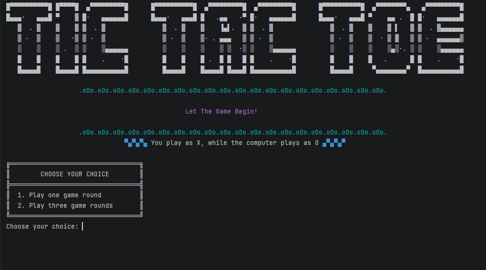

<div align="center">

# Tic-Tac-Toe CLI




A classic game of **Tic-Tac-Toe** for your terminal — play against the computer with an animated intro and colorful console UI.

</div>

---

## Demo

```
     |     |
  X  |  2  |  3
-----+-----+-----
     |     |
  4  |  O  |  6
-----+-----+-----
     |     |
  7  |  8  |  X
     |     |
```

## Features

- Animated typewriter ASCII title screen
- Colorful terminal output with ANSI escape codes
- Play as **X** against the computer (**O**)
- Two game modes:
  - Single round
  - Best of three rounds with a live scoreboard and final result
- Input validation for positions and menu choices
- Detects wins across rows, columns, and both diagonals — plus draws

## Requirements

| Tool   | Version   |
|--------|-----------|
| JDK    | 25+       |
| Maven  | 3.x       |

> The project uses Java's compact `main()` method syntax, so a JDK older than 25 will not compile it.

## Getting Started

Clone the repository:

```bash
git clone https://github.com/fadhelalmalki/tic-tac-toe-cli.git
cd tic-tac-toe-cli
```

Compile and run in one step:

```bash
mvn compile exec:java -Dexec.mainClass="org.example.TicTacToe"
```

Or package first, then run:

```bash
mvn package
java -cp target/classes org.example.TicTacToe
```

## How to Play

1. Launch the game and pick a mode: **one round** or **three rounds**.
2. You play as `X`; the computer plays as `O` and moves automatically.
3. On your turn, enter the number of the position you want to claim:

```
  1 | 2 | 3
 ---+---+---
  4 | 5 | 6
 ---+---+---
  7 | 8 | 9
```

4. Align three of your marks in a row, column, or diagonal to win.
5. If all nine positions fill up with no winner, the round ends in a draw.
6. In three-round mode, scores are tracked after every round and a final winner is announced at the end.

Invalid inputs (out-of-range numbers or taken positions) are rejected until you pick a valid spot.

## Project Structure

```
tic-tac-toe-cli/
├── assets/
│   └── title-screen.png                    # Title screen screenshot
├── .mvn/                                   # Maven configuration
├── src/
│   └── main/
│       └── java/
│           └── org/example/TicTacToe.java # Game entry point and logic
├── pom.xml                                 # Maven build file (JDK 25)
└── README.md
```
